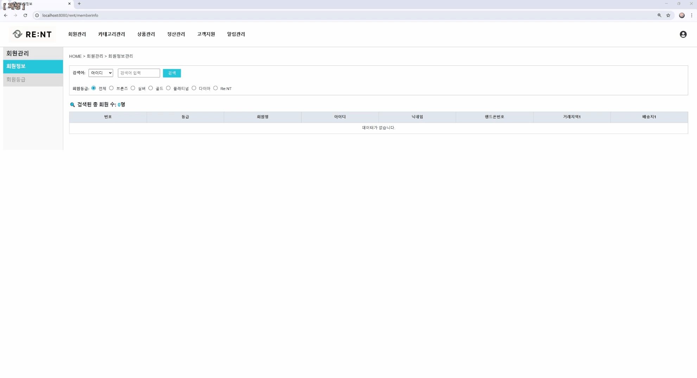
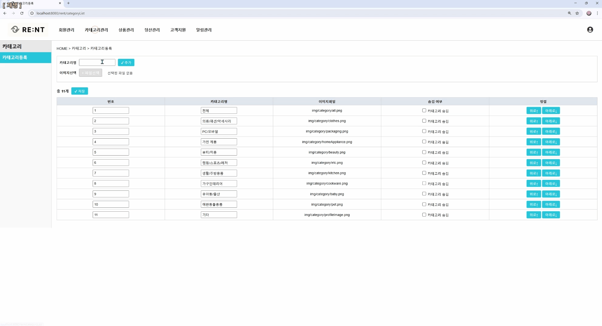
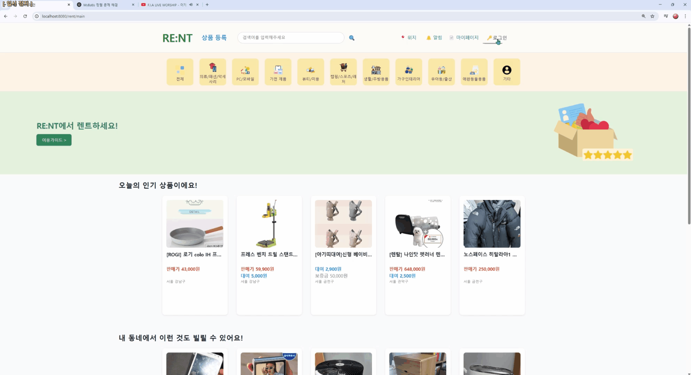
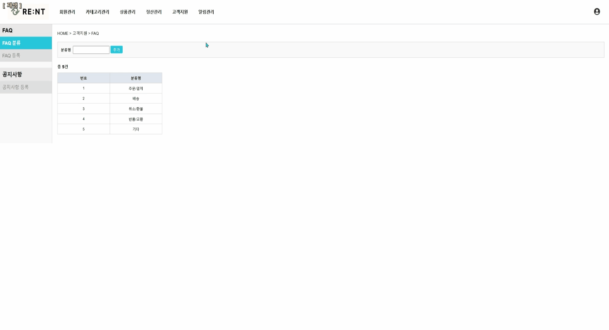
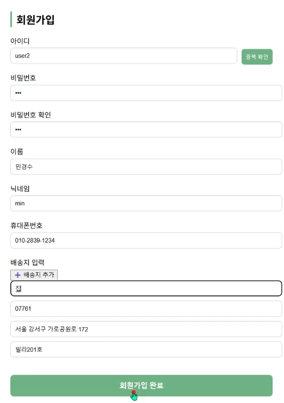

# Re:NT :: 렌탈 & 중고거래 통합 플랫폼

***Re:NT***는 “빌리고 사고파는 모든 것”을 하나의 서비스 안에서 해결할 수 있도록 만든 **렌탈 & 중고거래 플랫폼**입니다.  
중고 마켓의 ‘구매·판매’ 기능과 대여 전문 플랫폼의 ‘렌탈’ 기능을 결합해 **물건의 전체 수명 주기를 관리**할 수 있게 했습니다.

> 🎥 **시연 영상** :  
> 

> 🔗 **노션 링크** : https://www.notion.so/RE-NT-1c2aaacb929980ba863de5dc39c508d8
---

## 🚚 목차
- [1. 팀원 및 담당 업무](#1)
- [2. 서비스 소개 & 주요 기능](#2)
- [3. 개발 환경](#3)
- [4. 기능 시연](#4)
- [5. 주요 기능 상세 및 트러블슈팅](#5)
- [6. 일정 관리 협업](#6)
- [7. 화면 설계](#7)
- [8. 데이터베이스 설계](#8)

---

## 1. 팀원 및 담당 업무

| 팀원 | 담당 업무 |
|------|-----------|
| **이아림** | - 마이페이지: 구매상품 / 대여상품, 판매상품 / 대여상품 - 상품 및 주문 생명주기 전체 관리 - 프로젝트 총괄: 팀 내 일정 조율, 우선순위 결정, 이슈 관리, Git 브랜치 전략 등 - 발표 |
| **박기도** | - 마이페이지: 신고, 리뷰, 찜, 쪽지 목록 조회, 개인정보 수정, 배송지 관리 - 상품목록: 메인 화면, 필터 및 정렬 기능 포함 - API: FCM 알람, 카카오 맵, 카카오/네이버 소셜로그인, 다음 우편번호 - 피그마 및 디자인 총괄 - 시연영상 제작 |
| **추혜민** | - 관리자페이지: 회원/카테고리/정산/대여지연 등 관리 모듈 전체 구현 - DB 총괄: 멤버등급, 카테고리, 신고, 정산 테이블 설계 및 생성 - PPT 작성: 발표용 스크립트 및 시각자료 구성 |
| **김한재** | - 상품 등록(판매, 대여, 나눔) - 상품 상세 페이지: 대여하기, 구매하기, 리뷰, 쪽지, 신고, 공유 기능 구현 - API: Toss 결제 및 환불 기능 - DB 총괄: 메인 테이블(물품, 사용자, 거래, 리뷰) 생성 및 테스트 데이터 준비, FK 제약 구성 |

---

## 2. 서비스 소개 & 주요 기능

### 🎯 사용자 중심 서비스
- 판매/대여/나눔 방식으로 상품 등록 가능
- 보증금 기반의 대여 결제 및 반납 후 정산 시스템
- 쪽지 기능을 통한 사용자 간 거래 전 커뮤니케이션
- 찜/리뷰/평점으로 거래 전 평가 제공
- 카테고리/필터/검색 기능으로 빠른 탐색 가능

### 🛠 관리자 기능
- 회원 목록 및 정산 내역 관리
- 정산처리 자동화 및 지연건 수기 처리
- 공지 및 FAQ 등록/수정
- 신고 접수/처리, 알림 전송

---

## 3. 개발 환경

| 프론트엔드 | 백엔드 | 서버 & DB | API & 외부 서비스 | 디자인 & 협업 |
|:--:|:--:|:--:|:--:|:--:|
|     |     |    |      |     |

---

## 4. 기능 시연

### 1) 관리자 대시보드

### 1) 관리자 대시보드

### 1) 관리자 대시보드

### 1) 관리자 대시보드

**회원관리**  
_가입된 회원 목록 조회 및 등급 변경_  

**카테고리 관리**  
_상품 카테고리 추가/수정/삭제_  

**상품관리**  
_전체 상품 목록 확인 및 관리_  

**카카오 로그인/알람**  
_카카오 소셜 로그인 & 알림 설정_  

**주문/정산**  
_주문 내역 확인 및 정산 처리_  

**고객지원/알림관리**  
_고객문의 처리 및 알림 발송_  

---

### 2) 사용자 화면

**메인 피드**  
_오늘의 인기·카테고리별 상품 피드 보기_  

**상품 상세**  
_상품 정보, 리뷰, 판매자 프로필 확인_  

**대여하기 프로세스**  
_대여 기간 선택 후 신청_  

**회원가입**  
_아이디·비밀번호·배송지 입력_  

**마이페이지**  
_개인정보·주문내역·리뷰 관리_  

**찜/신고/쪽지**  
_찜하기, 신고하기, 쪽지 보내기 기능_  

**구매/리뷰**  
_구매 내역 확인 및 상품 리뷰 작성_  
*이미지 준비 중*  

## 5. 주요 기능 상세 및 트러블슈팅

<strong>📦 상품 등록 및 트러블슈팅</strong>

**프로세스 요약**
1. 상품 유형 선택 → 입력 폼 작성 → 등록 버튼 클릭
2. 서버에 결과 전송 → DB 저장 및 반영

**문제 해결 사례**
- Cos 라이브러리로 이미지 1개만 업로드 가능 → name 속성 분리하여 해결
- 대여상품 등록 시 시작/종료일 누락 → 필수입력 지정 추가
- 배송지 자동 입력 → 카카오맵 API로 위경도 자동 지정

<strong>💳 결제 및 트러블슈팅</strong>

**결제 흐름**

1. 상품 상세에서 구매 클릭 → 결제창 호출
2. 결제 완료 시 Toss API와 연동 → DB 저장 및 알림 전송

**문제 해결 사례**
- 결제 완료 후 confirm 처리로 응답 지연 → 중간 success 핸들러 추가
- 날짜 전달 안됨 → 세션 저장 방식으로 개선
- 403 오류 → 인증 헤더 및 키값 설정 보완

<strong>🔁 환불 및 트러블슈팅</strong>

**환불 흐름**

1. 마이페이지에서 환불 요청 → 사유 입력 및 전달
2. Toss API 연동 → 환불 완료 후 상태 전환

**문제 해결 사례**
- 사유 없이 요청 가능 → 프론트에서 alert 및 fetch 중단 처리
- paymentKey 누락 → .trim() 및 조건 처리
- 처리 결과 사용자 알림 미흡 → FCM 또는 이메일 실시간 알림 추가

<strong>🔔 기타 기능 및 트러블슈팅</strong>

- 마이페이지 새로고침 시 세션 유실 → 로컬스토리지로 복원 처리
- 정산 자동 처리 실패 → 상태값 및 트리거 누락 보완
- 알림 누락 → FCM 등록 토큰 확인 로직 추가
- 찜, 리뷰, 쪽지 기능 간 충돌 → 기능 분리 및 상태 관리 보완

<strong>🧩 API 활용 및 로그인/알림</strong>

**적용 기능 요약**
- FCM 알림 백그라운드 수신 및 UI 표시
- 

- 카카오맵 기반 위치 추적 및 자동 주소 변환
- 

- 카카오/네이버 소셜 로그인
- 

- 다음 우편번호 API로 배송지 자동입력
- 

**트러블슈팅 사례**
- 소셜 로그인 후 알림 전송 실패 → Authorization Code 재사용 오류 → 최초 로그인 여부 세션으로 판단 처리
- 추후 보완: JWT 기반 인증 및 Redis 스케줄러를 이용하여 반납기간에 대한 자동 알림 예정

<strong>📁 마이페이지 흐름 및 오류 처리</strong>

**마이페이지 처리 흐름 요약**

- 주문상태(orderStatus) 기반 구매/대여 상태 구분
- 각 단계별 버튼 제어 (예: 구매확정, 반납입력 등)

**트러블슈팅 사례**
- 초기 버튼 동작 오류 → `<button>` 명시 안함 → JS 미작동 → 명시로 해결
- 다른 JS 버전 혼용 문제 → 통일하여 해결
- 배송정보 자동화 미흡 → 스마트택배 API 고려

<strong>💵 정산 기능 자동화</strong>

**정산 처리 흐름 요약**
- 관리자 페이지에서 Read + Update 수행
- 정산완료 버튼 클릭 → DB 자동 업데이트

**트러블슈팅 사례**
- 기존에는 판매자만 처리되어 데이터 불일치 → 구매자도 같이 처리하도록 수정
- 테스트환경에서 강제 true 반환 → 실제 결제 연동 여부 검증 후 실행으로 변경 필요

---
## 6. 일정 관리 협업

---
## 7. 화면 설계

---

## 8. 데이터베이스 설계

---
